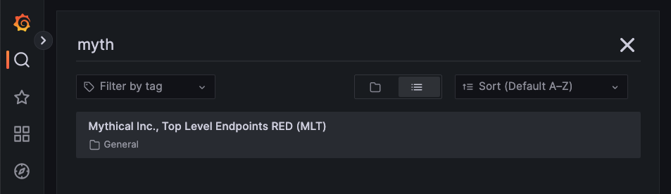
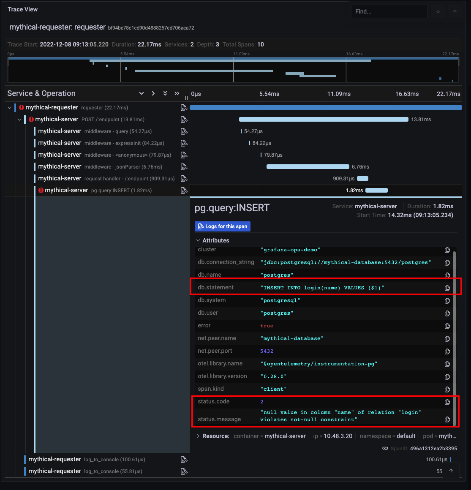

# Create and Import Multi-Window, Multi-Burn Rate Alerts, Recording Rules, and Dashboards into Grafana Cloud
We have just instrumented our cutting-edge critical business application, Mythical Beasts, and now would like to use SLOs to help the organization decide on whether to innovate faster and develop new Mythical Beasts features, or work on Service Stability and Performance optimization.

Since we already have rolled out the application to early access customers, we are tracking application performance, errors, and overall load in the `Mythical Inc., Top Level Endpoints RED (MLT)` dashboard.

(1) In your Grafana UI, click on the magnifying glass to search for the dashboard mentioned above. Type in `myth`. Click on the dashboard name to open the dashboard.

(2) Analyze your dashboard. This is considered a "RED" dashboard as it has three distinct sections of data: Request rates(R) in the top left, errors(E) in the top right, and duration(D) or latency metrics in the center.  Since this is a new service, you will likely notice that the error rate percentages are quite elevated. So, our SLOs are going to focus on error rates per endpoint first.

(3) If you'd like to get a sense of what types of errors the application is experiencing, you can drill into the endpoint's transaction details by clicking on the graph for the endpoint target. 

(3a) For example, if you were to click on the endpoint `/login` in the upper right graph, a new tab with Grafana's "Explore" feature will appear. You will see that your Distributed tracing instance data source has been pre-populated in the top dropdown, and the "Tags" field has been pre-populated with the name of your endpoint (/login) as the `http.target` value, and the `status.code` field has been set to `2` (or error. The value of `0` is considered a good transaction).

(3b) Click on one of the distributed Trace IDs. This will add a second pane to your existing window with that trace's full transaction path, and shows you not only the sequence and durations of each span within the trace, but also provides span details such as tags, process metadata, and trace logs(if any were recorded).  

(3c) Since we are filtered on errored transactions, you will notice that one or more of the spans within your trace has a red exclamation mark next to it, signifying an errored span.  Click on that particular span and then click on `Attributes`.  While your particular error status message may be different, I have a `db.statement` field referencing a postgresql query.  I also see an attribute called `status.message` that is associated with our errored status.code. I have a "null value" error, signifying there is a problem with our postgresql query.

If you would like more details concerning the features of Grafana's tracing visualization in Explore, go here: https://grafana.com/docs/grafana/latest/explore/trace-integration/

First, we will do an SLO based on successful requests.
From the sloth directory, cd examples.  
Copy the getting_started.yml file with cp getting_started.yml slo-requests.yml
Edit (vi) slo-requests.yml
sum(rate(mythical_request_times_count{job="eStore-server", status!~"5.."}[1m]))
sum(rate(mythical_request_times_count{job="eStore-server", status=~"5.."}[1m]))
sum by (endpoint) (rate(mythical_request_times_count{job="eStore-server"}[1m]))

Second, we will first need to create a recording rule to determine what percentage of transactions are above or below 3 seconds.
beasts_service_slo:success_per_request:ratio_rate1h

