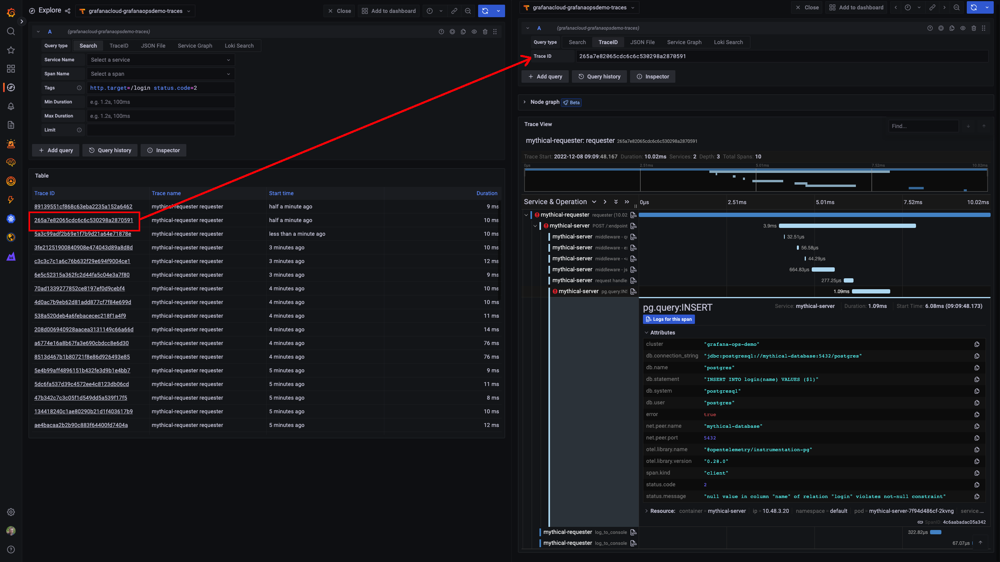

# Breakout 1 - Create and Import Multi-Window, Multi-Burn Rate Alerts, Recording Rules, and Dashboards into Grafana Cloud

## Pre-requisites

* Linux shell knowledge
* vim or Nano/Pico editor knowledge
* Access to the WebShell via the link you received in your workshop email
  * Note: Username and password should have been pre-supplied

This workshop includes the editing of files in the WebTerminal you have been given login details for. Both vim and pico have been included in the webterminal to allow you to carry out this editing. All of the examples in this breakout use `pico`, as it’s a simple to use editor, but feel free to use `vim` if you’re familiar with it.

The Pico editor can be navigated using your keyboard cursor keys (as well as Page-Up and Page-Down to move pages), as well as some specific `Ctrl` key based shortcuts:

* Paste: **Ctrl-V**
* Save file: **Ctrl-O**
* Quit: **Ctrl-X**
* Cancel: **Ctrl-C**

## Breakout
We have just instrumented our cutting-edge critical business application, Mythical Beasts, and now would like to use SLOs to help the organization decide on whether to innovate faster and develop new Mythical Beasts features, or work on Service Stability and Performance optimization.

Since we already have rolled out the application to early access customers, we are tracking application performance, errors, and overall load in the `Mythical Inc., Top Level Endpoints RED (MLT)` dashboard in our Grafana instance.

(1) Log into your Grafana instance by going to the Grafana website using URL, login and password credentials you were sent.

(2) In your Grafana UI, click on the magnifying glass to search for the dashboard mentioned above. Type in `myth`. Click on the dashboard name to open the dashboard.


(3) Analyze your dashboard. This is considered a "RED" dashboard as it has three distinct sections of data: Request rates(R) in the top left, errors(E) in the top right, and duration(D) or latency metrics in the center.  Since this is a new service, you will likely notice that the error rate percentages are quite elevated. So, our SLOs are going to focus on error rates per endpoint first.


(4) If you'd like to get a sense of what types of errors the application is experiencing, you can drill into the endpoint's transaction details by clicking on the graph for the endpoint target. 

(4a) For example, if you were to click on the endpoint `/login` in the upper right graph, a new tab with Grafana's "Explore" feature will appear. You will see that your Distributed tracing instance data source has been pre-populated in the top dropdown, and the "Tags" field has been pre-populated with the name of your endpoint (/login) as the `http.target` value, and the `status.code` field has been set to `2` (or error. The value of `0` is considered a good transaction).



(4b) Click on one of the distributed Trace IDs. This will add a second pane to your existing window with that trace's full transaction path, and shows you not only the sequence and durations of each span within the trace, but also provides span details such as tags, process metadata, and trace logs(if any were recorded).  

(4c) Since we are filtered on errored transactions, you will notice that one or more of the spans within your trace has a red exclamation mark next to it, signifying an errored span.  Click on that particular span and then click on `Attributes`.  While your particular error status message may be different, I have a `db.statement` field referencing a postgresql query.  I also see an attribute called `status.message` that is associated with our errored status.code. I have a "null value" error, signifying there is a problem with our postgresql query.


If you would like more details concerning the features of Grafana's tracing visualization in Explore, go here: https://grafana.com/docs/grafana/latest/explore/trace-integration/

### Create SLO files based on existing examples from Sloth

(1) Start by logging into the webterminal with your username and password. This will log you into a home directory in a Debian Linux shell where we’ll edit some files and deploy an application to a k8s cluster.

    Your home directory includes a few things:

   * A `sloth` directory containing its executable and a example files.  This was created on your behalf doing a `git clone https://github.com/slok/sloth.git`; downloading the sloth executable from [here](https://github.com/slok/sloth/releases/tag/v0.11.0); and then performing a `chmod +x` to the executable file and renaming the file to sloth.
   * A `mimirtool` folder. We downloaded Mimirtool from the Assets section of [Mimir's latest release page](https://github.com/grafana/mimir/releases). Mimir documentation can be found [here](https://grafana.com/docs/mimir/latest/operators-guide/tools/mimirtool/)
   
   As mentioned in the workshop presentation, we will use Sloth to create the SLO yaml definitions file, and then we will use Mimirtool to import those rules within the SLO definitions file.
   
   * We will also need to get an API key in order for Mimirtool to authenticate with Grafana Cloud.
   * Finally, we will import an SLO dashboard provided by Sloth to track our SLOs visually.

   We’re going to first modify Sloth's "Getting Started" file for a single SLO on a single application endpoint, and see them in Grafana Cloud.

(2) Run:
   ```bash
   pico ./sloth/examples/getting-started.yaml
   ```
   in the shell.

(3) In this source file, we need to edit many of the definitions.

   a. **version**: "prometheus/v1" -> we will keep this definition as our application metrics are Prometheus-based.
   
   b. **service**: "xxx" -> Let's change this value to our service name, `mythical-beasts`
   c. **labels**: owner, repo, and tier.  These labels are added to our recording rules.  
     * For now, let's delete the `repo` line
     * Keep the line with `tier` as-is (as mythical beasts is a tier 2 application)
     * Change the value of owner from "myteam" to first initial and last name.
   d. Next are the **slos**.  Like with this example, we are going to stick with just one SLO - a request/error rate SLO - but our SLO target is going to be much lower.
     * Change the comment from "We allow failing (5xx and 429) 1 request every 1000 requests (99.9%)." to `We allow failing (5xx and 429) 1 of every 10 requests (90%). 
     * Since this SLO will be for the login endpoint only, change the name from "requests-availability" to `login-availability`
     * Change the objective from 99.9 to `90.0`
   e. Keep the **description** as-is.  This description does not generate any output.
4. We now get to the SLIs driving the SLO.  Sloth is a ratio-based SLO tool, and we need to define two SLIs: (1) our error count and (2) our total count.
   This `....` function is to....

3. At the top of the source file, add:

   ```....
   ```


4. Move to the `BLAH` function definition. You can see XXXX. We’re going to modify the existing xxxx.

   After the `BLAH` line, add a newline with ‘Enter’, and then add:
   ```blH
    ...
   ```

   This will do a few things......
 

(1) Using the credentials provided prior to the course, log into your webshell and go to Sloth's root directory (WHERE WILL WE INSTALL?)
  (1a) cd ~/sloth
  (1b) in the ./sloth/bin directory contains the sloth binary. In the ./sloth/examples directory, sloth ships with some examples to get started.  Let's go to the examples directory and copy the `getting-started.yml` file.  This is the same file as seen on the sloth.dev web site: https://sloth.dev/examples/default/getting-started/
  (1c) cp getting-started.yml mythical.yml
(2) We will now edit the mythical.yml file and use it to define our SLO.


First, we will do an SLO based on successful requests.
From the sloth directory, cd examples.  
Copy the getting_started.yml file with cp getting_started.yml slo-requests.yml
Edit (vi) slo-requests.yml
sum(rate(mythical_request_times_count{job="eStore-server", status!~"5.."}[1m]))
sum(rate(mythical_request_times_count{job="eStore-server", status=~"5.."}[1m]))
sum by (endpoint) (rate(mythical_request_times_count{job="eStore-server"}[1m]))

Second, we will first need to create a recording rule to determine what percentage of transactions are above or below 3 seconds.
beasts_service_slo:success_per_request:ratio_rate1h


