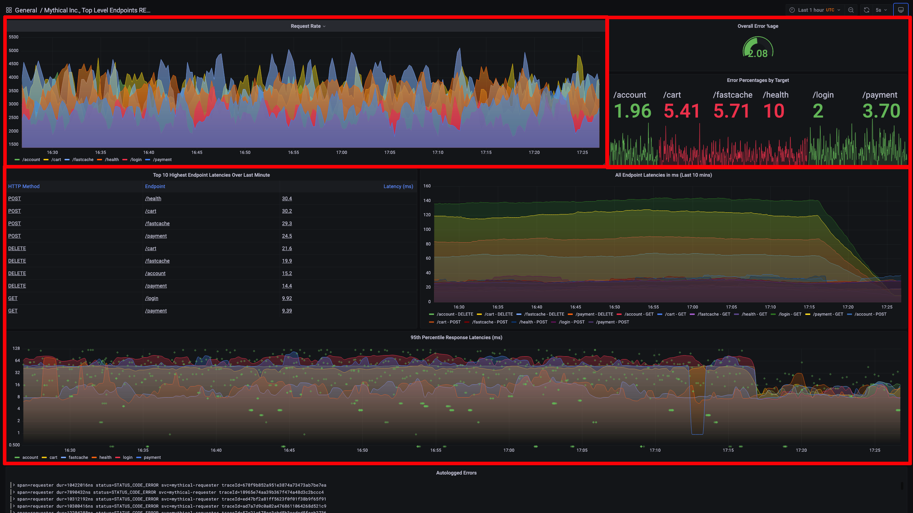

# Create and Import Multi-Window, Multi-Burn Rate Alerts, Recording Rules, and Dashboards into Grafana Cloud
We have just instrumented our cutting-edge critical business application, Mythical Beasts, and now would like to use SLOs to help the organization decide on whether to innovate faster and develop new Mythical Beasts features, or work on Service Stability and Performance optimization.

Since we already have rolled out the application to early access customers, we are tracking application performance, errors, and overall load in the `Mythical Inc., Top Level Endpoints RED (MLT)` dashboard.

(1) In your Grafana UI, click on the magnifying glass to search for the dashboard mentioned above. Type in `myth`. Click on the dashboard name to drill in.

(2) In the dashboard, 

First, we will do an SLO based on successful requests.
From the sloth directory, cd examples.  
Copy the getting_started.yml file with cp getting_started.yml slo-requests.yml
Edit (vi) slo-requests.yml
sum(rate(mythical_request_times_count{job="eStore-server", status!~"5.."}[1m]))
sum(rate(mythical_request_times_count{job="eStore-server", status=~"5.."}[1m]))
sum by (endpoint) (rate(mythical_request_times_count{job="eStore-server"}[1m]))

Second, we will first need to create a recording rule to determine what percentage of transactions are above or below 3 seconds.
beasts_service_slo:success_per_request:ratio_rate1h

